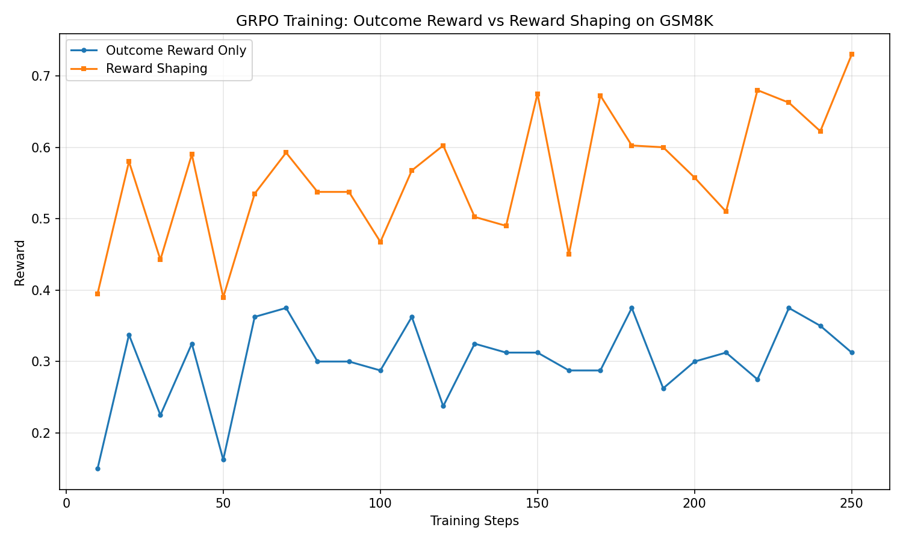

# GRPO Reward Shaping on GSM8K

Comparing **Outcome Reward** vs **Reward Shaping** for training LLMs with GRPO on mathematical reasoning.

## Key Result



Reward Shaping achieves **0.73** final reward vs **0.31** for Outcome-only — a **2.4x improvement** over 250 training steps on GSM8K.

## Method

**Outcome Reward Only**
- +1.0 if final answer is correct

**Reward Shaping**
- +1.0 if final answer is correct
- +0.2 if output contains `####` format marker
- +0.2 if output contains reasoning steps (arithmetic expressions)

This mirrors the reward design in DeepSeek-R1.

## Setup

- Model: Qwen2.5-1.5B-Instruct
- Dataset: GSM8K (500 train samples)
- Algorithm: GRPO via `trl`
- Hardware: A800 80G

## Install
```bash
pip install torch==2.6.0 --index-url https://download.pytorch.org/whl/cu124
pip install transformers trl datasets accelerate
```

## Run
```bash
python train_outcome_reward.py
python train_reward_shaping.py
python plot_results.py
```

## Conclusion

Process-level reward shaping significantly improves training efficiency and final performance vs sparse outcome-only reward, consistent with DeepSeek-R1 findings.
